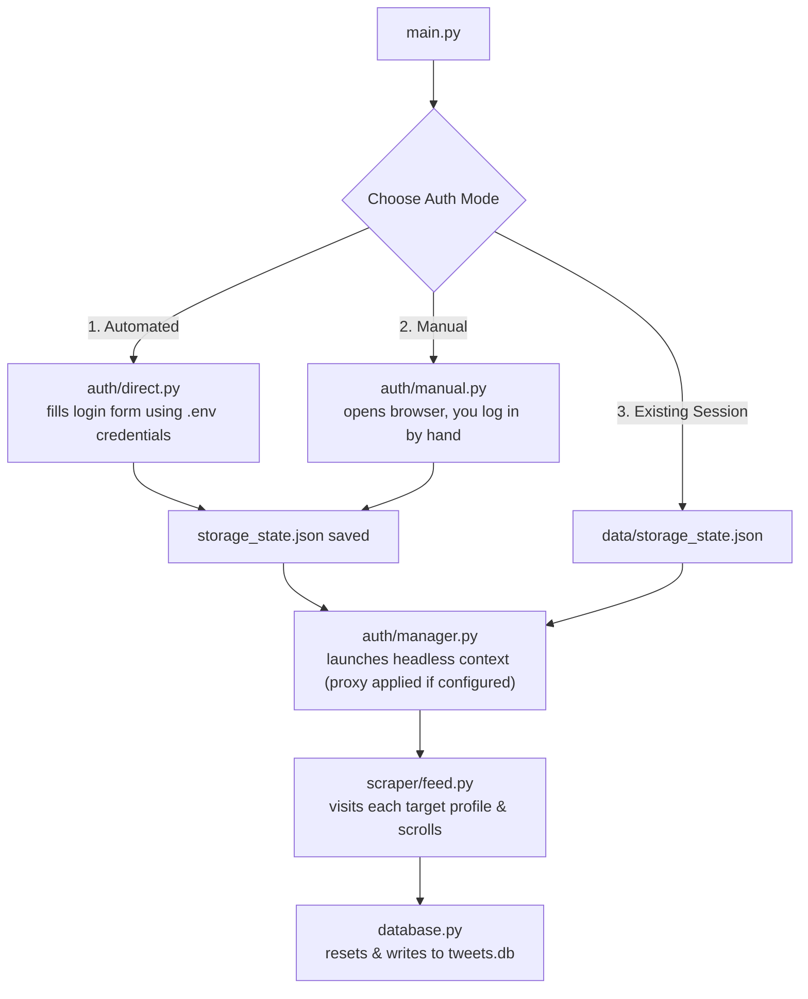
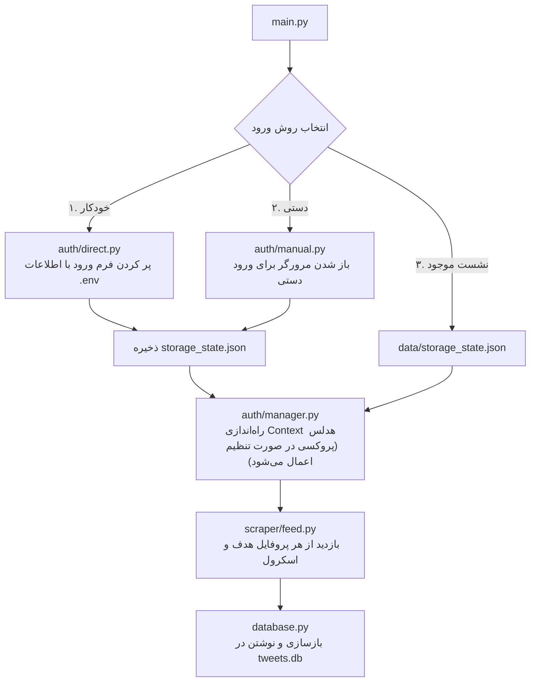

<div align="center">

# 🧵 X Feed Engine

**A Playwright-powered feed scraper that logs into X (Twitter) and collects fresh tweets from a curated list of accounts into a local SQLite database.**


**[English](#-english)** • **[فارسی](#-فارسی)**

</div>

---

<a id="-english"></a>
## 🇬🇧 English

### Table of Contents
- [Overview](#overview)
- [Features](#features)
- [Architecture](#architecture)
- [Project Structure](#project-structure)
- [Requirements](#requirements)
- [Installation](#installation)
- [Configuration](#configuration)
- [Usage](#usage)
- [Database Schema](#database-schema)
- [Security Notes](#security-notes)
- [A Note on Responsible Use](#a-note-on-responsible-use)

### Overview

**X Feed Engine** is a personal automation tool that drives a headless Chromium browser (via [Playwright](https://playwright.dev/)) to sign in to an X (Twitter) account and pull recent posts from a configurable list of target accounts — useful for building a private, offline-readable feed digest (e.g. tracking crypto, markets, or news accounts) without relying on X's own timeline or API.

All results are written to a local **SQLite** database that is reset on every run, giving you a clean snapshot of "what's new" each time the engine executes.

### Features

- 🔐 **Three authentication modes** — automated login, interactive manual login, or reuse of an existing saved session
- 🌐 **Optional proxy support** — disabled (direct connection) by default; enable it in `config.json` if direct access to X is restricted in your network/region
- 🎯 **Configurable target list** — scrape as many accounts as you like, defined in `config.json`
- ⏱️ **Smart time-window filtering** — stops scrolling once it hits a streak of tweets older than your cutoff, while still capturing older *pinned* tweets correctly
- 🔁 **Quote-tweet aware** — captures quoted tweet text alongside the main content
- 🗄️ **Clean SQLite output** — one row per tweet, ready to query, export, or feed into another pipeline
- 📝 **Structured logging** via [loguru](https://github.com/Delgan/loguru)

### Architecture



### Project Structure

```
x_feed_engine/
├── main.py                  # Entry point — CLI menu + orchestration
├── config.json              # Your local settings incl. proxy (never commit this)
├── config.example.json      # Template for config.json — safe to commit
├── .env                     # Credentials (never commit this)
├── requirements.txt
├── data/
│   ├── storage_state.json   # Saved browser session (created at runtime)
│   └── tweets.db            # SQLite output (recreated every run)
└── x_feed/
    ├── config.py             # Loads config.json + .env into one dict
    ├── database.py           # SQLite schema + insert helpers
    ├── auth/
    │   ├── direct.py          # Automated login flow
    │   ├── manual.py          # Manual/interactive login flow
    │   └── manager.py         # Browser context + session injection
    └── scraper/
        └── feed.py            # Profile scraping + scroll/collect logic
```

### Requirements

- Python 3.11+
- An X (Twitter) account
- (Optional) A proxy, if direct access to X is restricted in your network/region — see [Configuration](#configuration) below

### Installation

```bash
# 1. Create and activate a virtual environment
python -m venv venv
source venv/bin/activate        # Windows: venv\Scripts\activate

# 2. Install dependencies
pip install -r requirements.txt

# 3. Install the Playwright browser binary
playwright install chromium

# 4. Create your local config from the template
cp config.example.json config.json
```

### Configuration

**`.env`** — your X credentials (used only by the automated login mode):

```env
X_USER=your_twitter_username
X_PASS=your_twitter_password
X_EMAIL=your_twitter_email
```

**`config.json`** — copy this from `config.example.json` (it's gitignored, since it can hold your proxy details). It controls scraping behavior, target accounts, and the optional proxy:

```json
{
  "proxy": {
    "enabled": false,
    "server": "socks5://127.0.0.1:10808",
    "username": "",
    "password": ""
  },
  "scraper": {
    "mode": "both",
    "max_tweets_per_user": 10,
    "time_window_hours": 48,
    "target_users": ["username1", "username2"]
  }
}
```

| Field | Description |
|---|---|
| `proxy.enabled` | `true` to route the browser through a proxy, `false` for a normal direct connection |
| `proxy.server` | Proxy address, e.g. `socks5://127.0.0.1:10808` or `http://host:port` — ignored when `enabled` is `false` |
| `proxy.username` / `proxy.password` | Optional credentials, only sent if your proxy requires auth |
| `mode` | Filtering strategy (`time`, `count`, or `both`) |
| `max_tweets_per_user` | Cap on tweets collected per account |
| `time_window_hours` | Only keep tweets newer than this many hours |
| `target_users` | List of X usernames (no `@`) to scrape |

No proxy? Just leave `proxy.enabled` as `false` (or omit the `proxy` section entirely) and the engine connects directly — nothing else to edit.

### Usage

```bash
python main.py
```

You'll be prompted to choose an authentication mode:

1. **Automated Login** — uses `X_USER` / `X_PASS` / `X_EMAIL` from `.env`
2. **Manual Login** — opens a real browser window for you to log in by hand (handles 2FA/verification cleanly)
3. **Existing Session** — reuses a previously saved `data/storage_state.json`

Once authenticated, the engine visits each account in `target_users`, scrolls and collects matching tweets, and saves everything to `data/tweets.db`.

### Database Schema

```sql
CREATE TABLE tweets (
    id INTEGER PRIMARY KEY AUTOINCREMENT,
    target_account TEXT,
    user TEXT,
    text TEXT,
    timestamp TEXT,
    fetched_at TIMESTAMP DEFAULT CURRENT_TIMESTAMP
);
```

> ⚠️ The table is dropped and recreated on **every** run — back up `tweets.db` first if you want to keep history across runs.

### Security Notes

- **Never commit `.env`, `config.json`, or `data/storage_state.json`.** `storage_state.json` stores your live session cookies (`auth_token`, `ct0`) — anyone with that file can access your account without your password. `config.json` can hold your proxy host and credentials. All three are already excluded via `.gitignore`; only `config.example.json` (no secrets, proxy disabled) is meant to be committed.
- If a session file is ever exposed or shared, log out of that session (or change your password) to invalidate it.
- Treat `data/tweets.db` as local-only if the target list includes anything you wouldn't want to publish.

### A Note on Responsible Use

Automated login and scraping may be subject to X's Terms of Service. This tool is intended for personal, small-scale use with your own account — keep request rates modest, respect the accounts you're pulling from, and avoid redistributing collected content at scale.

---

<a id="-فارسی"></a>
## 🇮🇷 فارسی

<div dir="rtl">

### فهرست مطالب
- [معرفی](#معرفی)
- [قابلیت‌ها](#قابلیت‌ها)
- [معماری](#معماری)
- [ساختار پروژه](#ساختار-پروژه)
- [پیش‌نیازها](#پیش‌نیازها)
- [نصب](#نصب)
- [پیکربندی](#پیکربندی)
- [نحوه استفاده](#نحوه-استفاده)
- [ساختار پایگاه‌داده](#ساختار-پایگاه‌داده)
- [نکات امنیتی](#نکات-امنیتی)
- [یادداشتی درباره استفاده مسئولانه](#یادداشتی-درباره-استفاده-مسئولانه)

### معرفی

**X Feed Engine** یک ابزار شخصی برای اتوماسیون است که با استفاده از [Playwright](https://playwright.dev/) یک مرورگر Chromium بدون رابط گرافیکی (headless) را کنترل می‌کند تا وارد حساب X (توییتر) شود و توییت‌های تازه‌ی فهرستی از اکانت‌های مشخص‌شده را جمع‌آوری کند. این ابزار برای ساختن یک خلاصه‌ی خبری شخصی و آفلاین (مثلاً برای دنبال کردن اکانت‌های ارز دیجیتال، بازار یا اخبار) بدون نیاز به تایم‌لاین یا API خود X مناسب است.

نتایج در یک پایگاه‌داده‌ی **SQLite** محلی ذخیره می‌شوند که در هر اجرا از نو ساخته می‌شود؛ یعنی هر بار که برنامه را اجرا می‌کنید، یک عکس فوری و تمیز از «چه چیز تازه‌ای منتشر شده» دریافت می‌کنید.

### قابلیت‌ها

- 🔐 **سه روش ورود** — ورود خودکار، ورود دستی و تعاملی، یا استفاده از نشست (Session) ذخیره‌شده‌ی قبلی
- 🌐 **پشتیبانی اختیاری از پروکسی** — به‌طور پیش‌فرض غیرفعال (اتصال مستقیم) است؛ در صورت نیاز آن را در `config.json` فعال کنید (مثلاً اگر دسترسی مستقیم به X در شبکه یا منطقه‌ی شما محدود باشد)
- 🎯 **فهرست هدف قابل تنظیم** — تعداد دلخواهی از اکانت‌ها را در `config.json` تعریف کنید
- ⏱️ **فیلتر هوشمند بازه‌ی زمانی** — با رسیدن به چند توییت قدیمی پیاپی، اسکرول متوقف می‌شود؛ در عین حال توییت‌های **سنجاق‌شده (Pinned)** قدیمی هم به‌درستی شناسایی می‌شوند
- 🔁 **پشتیبانی از توییت‌های نقل‌قول‌شده (Quote Tweet)** — متن توییت نقل‌شده هم همراه با متن اصلی ذخیره می‌شود
- 🗄️ **خروجی تمیز در SQLite** — هر توییت یک ردیف، آماده برای کوئری گرفتن، خروجی گرفتن یا اتصال به یک پایپ‌لاین دیگر
- 📝 **لاگ‌گیری ساخت‌یافته** با کتابخانه‌ی [loguru](https://github.com/Delgan/loguru)

### معماری



### ساختار پروژه

```
x_feed_engine/
├── main.py                  # نقطه‌ی شروع — منوی خط فرمان و هماهنگی کلی
├── config.json               # تنظیمات محلی شما شامل پروکسی (هرگز کامیت نکنید)
├── config.example.json       # قالب برای config.json — کامیت کردنش مشکلی ندارد
├── .env                       # اطلاعات ورود (هرگز آن را کامیت نکنید)
├── requirements.txt
├── data/
│   ├── storage_state.json    # نشست ذخیره‌شده‌ی مرورگر (در زمان اجرا ساخته می‌شود)
│   └── tweets.db              # خروجی SQLite (در هر اجرا از نو ساخته می‌شود)
└── x_feed/
    ├── config.py               # بارگذاری config.json و .env در یک دیکشنری واحد
    ├── database.py             # ساختار جدول SQLite و توابع درج داده
    ├── auth/
    │   ├── direct.py            # فرایند ورود خودکار
    │   ├── manual.py            # فرایند ورود دستی/تعاملی
    │   └── manager.py           # مدیریت Context مرورگر و تزریق نشست
    └── scraper/
        └── feed.py               # منطق اسکرپ پروفایل و اسکرول/جمع‌آوری
```

### پیش‌نیازها

- پایتون نسخه ۳.۱۱ یا بالاتر
- یک حساب کاربری در X (توییتر)
- (اختیاری) یک پروکسی، در صورتی که دسترسی مستقیم به X در شبکه یا منطقه‌ی شما محدود باشد — به بخش [پیکربندی](#پیکربندی) مراجعه کنید
<div dir='ltr'>

### نصب

```bash
# ۱. ساخت و فعال‌سازی محیط مجازی
python -m venv venv
source venv/bin/activate        # ویندوز: venv\Scripts\activate

# ۲. نصب وابستگی‌ها
pip install -r requirements.txt

# ۳. نصب مرورگر Playwright
playwright install chromium

# ۴. ساخت فایل پیکربندی محلی از روی قالب
cp config.example.json config.json
```

### پیکربندی

**`.env`** — اطلاعات ورود شما به X (فقط در روش ورود خودکار استفاده می‌شود):

```env
X_USER=your_twitter_username
X_PASS=your_twitter_password
X_EMAIL=your_twitter_email
```


**`config.json`** — این فایل را از روی `config.example.json` کپی کنید (در `.gitignore` قرار دارد، چون می‌تواند اطلاعات پروکسی شما را نگه دارد). رفتار اسکرپر، فهرست اکانت‌های هدف، و پروکسی اختیاری را کنترل می‌کند:

```json
{
  "proxy": {
    "enabled": false,
    "server": "socks5://127.0.0.1:10808",
    "username": "",
    "password": ""
  },
  "scraper": {
    "mode": "both",
    "max_tweets_per_user": 10,
    "time_window_hours": 48,
    "target_users": ["username1", "username2"]
  }
}
```

| فیلد | توضیح |
|---|---|
| `proxy.enabled` | `true` برای عبور مرورگر از یک پروکسی، `false` برای اتصال مستقیم عادی |
| `proxy.server` | آدرس پروکسی، مثلاً `socks5://127.0.0.1:10808` یا `http://host:port` — در صورت `false` بودن `enabled` نادیده گرفته می‌شود |
| `proxy.username` / `proxy.password` | اطلاعات ورود اختیاری، فقط در صورتی که پروکسی شما نیاز به احراز هویت داشته باشد ارسال می‌شود |
| `mode` | استراتژی فیلترکردن (`time`، `count` یا `both`) |
| `max_tweets_per_user` | سقف تعداد توییت جمع‌آوری‌شده برای هر اکانت |
| `time_window_hours` | فقط توییت‌های جدیدتر از این تعداد ساعت نگه داشته می‌شوند |
| `target_users` | فهرست نام کاربری‌های X (بدون `@`) برای اسکرپ |

پروکسی ندارید؟ کافی است `proxy.enabled` را روی `false` بگذارید (یا کل بخش `proxy` را حذف کنید) تا موتور مستقیماً متصل شود — نیازی به ویرایش چیز دیگری نیست.

### نحوه استفاده


```bash
python main.py
```

</div>

از شما خواسته می‌شود یکی از روش‌های ورود را انتخاب کنید:

۱. **ورود خودکار** — با استفاده از `X_USER`، `X_PASS` و `X_EMAIL` از فایل `.env`
۲. **ورود دستی** — یک پنجره‌ی مرورگر واقعی باز می‌شود تا خودتان وارد شوید (تأیید دومرحله‌ای/ایمیل را هم به‌خوبی مدیریت می‌کند)
۳. **نشست موجود** — استفاده از فایل `data/storage_state.json` ذخیره‌شده از قبل

پس از ورود، برنامه به سراغ هر اکانت در `target_users` می‌رود، اسکرول کرده و توییت‌های منطبق را جمع‌آوری می‌کند، سپس همه را در `data/tweets.db` ذخیره می‌کند.

### ساختار پایگاه‌داده
<div dir='ltr'>


```sql
CREATE TABLE tweets (
    id INTEGER PRIMARY KEY AUTOINCREMENT,
    target_account TEXT,
    user TEXT,
    text TEXT,
    timestamp TEXT,
    fetched_at TIMESTAMP DEFAULT CURRENT_TIMESTAMP
);
```
<div>

> ⚠️ این جدول در **هر بار** اجرای برنامه حذف و از نو ساخته می‌شود — اگر می‌خواهید تاریخچه‌ی چند اجرا را نگه دارید، ابتدا از `tweets.db` نسخه‌ی پشتیبان تهیه کنید.

### نکات امنیتی

- **هرگز فایل‌های `.env`، `config.json` یا `data/storage_state.json` را کامیت نکنید.** فایل `storage_state.json` شامل کوکی‌های نشست فعال شما (`auth_token` و `ct0`) است — هر کسی که این فایل را داشته باشد می‌تواند بدون نیاز به رمز عبور به حساب شما دسترسی پیدا کند. فایل `config.json` نیز می‌تواند آدرس و اطلاعات ورود پروکسی شما را در خود داشته باشد. هر سه از قبل در `.gitignore` مستثنا شده‌اند؛ فقط `config.example.json` (بدون اطلاعات محرمانه، با پروکسی غیرفعال) برای کامیت شدن در نظر گرفته شده است.
- اگر فایل نشست به هر شکلی افشا یا به اشتراک گذاشته شد، از آن نشست خارج شوید یا رمز عبور خود را تغییر دهید تا نشست باطل شود.
- اگر فهرست هدف شامل اکانت‌هایی است که نمی‌خواهید علنی شوند، با `data/tweets.db` نیز به‌عنوان یک فایل کاملاً محلی رفتار کنید.

### یادداشتی درباره استفاده مسئولانه

ورود خودکار و اسکرپ کردن ممکن است مشمول قوانین و مقررات استفاده (Terms of Service) شرکت X باشد. این ابزار برای استفاده‌ی شخصی و در مقیاس کوچک با حساب کاربری خودتان طراحی شده است — نرخ درخواست‌ها را معقول نگه دارید، به اکانت‌هایی که از آن‌ها داده جمع‌آوری می‌کنید احترام بگذارید، و از انتشار گسترده‌ی محتوای جمع‌آوری‌شده خودداری کنید.

</div>

---

<div align="center">

Made with 🐍 Python & Playwright

</div>
